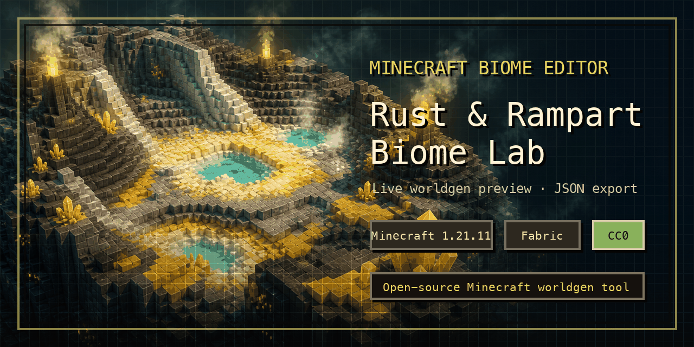

# Biome Lab for Minecraft Mods

Open-source biome and worldgen parameter editor for Minecraft mods with a live 3D preview.

[](https://musshiyaki.github.io/rust-rampart-biome-lab/)
[](LICENSE)
[](https://www.minecraft.net/)



**Live app:** <https://musshiyaki.github.io/rust-rampart-biome-lab/>

**Unofficial tool. Not approved by or associated with Mojang or Microsoft.**

Biome Lab for Minecraft Mods is a browser-based tool for tuning Minecraft mod biome parameters, world generation values, placed features, surface rules, and block assignments with an immediate bird's-eye preview.

It currently ships with a complete Rust & Rampart `0.1.0` target profile for `rust_rampart:sulfur_valley` on Minecraft `1.21.11`. That profile is the first working adapter, not the ceiling of the idea.

The goal is simple: make Minecraft mod biome design less blind. Change the numbers, generate a preview, export JSON, and share the exact parameter state with a URL.

The preview is an original approximation written for this project. It does not include Minecraft or Mojang source code, decompiled code, game files, official textures, official fonts, official logos, or official audio.

## Features

- Minecraft-style biome and worldgen parameter editor
- Live bird's-eye terrain preview for basin shape, vents, material patches, springs, crystals, and structure silhouettes
- One-click demo presets for default, crystal-heavy, and vent-heavy biome variants
- English and Japanese UI
- JSON copy, download, and share URL support
- Creative-inventory-style block picker
- Search by block id or display name
- Hover tooltips for block names and ids
- Structure section with ruin, tower, arch, monolith, and platform preview shapes
- Mode-specific full-coverage fields for Minecraft data packs, Forge, NeoForge, and Fabric handoff JSON
- Local resource-pack texture loading for vanilla block icons
- Built-in example MOD blocks rendered as generated color swatches
- Static GitHub Pages deployment, no backend required

## Use Cases

- Design custom Minecraft mod biomes with visual feedback instead of editing constants blind
- Tune Fabric Minecraft mod biome parameters before hard-coding worldgen constants
- Compare biome surface rule thresholds visually
- Share a biome design preset with another mod developer
- Export JSON for generated biome, configured feature, and placed feature data
- Prototype terrain basins, vents, pools, material patches, and crystal fields

## Current Target Profile

The public app is positioned as a biome lab for Minecraft mods. Version `0.1.0` includes one complete target profile so the editor is useful immediately instead of being a hollow generic UI.

| Target | Value |
| --- | --- |
| Minecraft | `1.21.11` |
| Mod | `Rust & Rampart 0.1.0` |
| Biome | `rust_rampart:sulfur_valley` |
| Loader context | Fabric-oriented worldgen data |

Future versions can add named target profiles, datapack import/export, custom schema loading, and additional Minecraft versions.

## Parameter Coverage

The fixed controls cover the current Rust & Rampart target profile's main biome/worldgen values. The **Full Coverage / Extra JSON** section is open by default and starts with a target mode selector plus first-pass schema builders:

- **Minecraft / Data Pack**: common worldgen registry path/body builder plus arbitrary data pack JSON
- **Forge**: Forge biome modifier builder plus raw Forge biome modifier JSON
- **NeoForge**: NeoForge biome modifier builder plus raw NeoForge biome modifier JSON
- **Fabric**: Fabric `BiomeModifications` handoff fields for code/datagen workflows

This keeps loader-specific fields visible only when they matter while still allowing arbitrary new fields to ride along in the exported JSON. The schema builders are intentionally pragmatic, not complete validators; the raw JSON fields remain the escape hatch for mod-defined Codecs and newer loader fields.

See [Parameter Coverage](docs/parameter-coverage.md) for the current coverage matrix and the path toward schema-driven coverage.

## How to Use

1. Open the [live app](https://musshiyaki.github.io/rust-rampart-biome-lab/).
2. Adjust parameters in the right-hand panel.
3. Press **Generate**, or enable **Instant generation** for live updates.
4. Inspect the bird's-eye preview on the left.
5. Try a **Demo preset** if you want an instant starting point.
6. Copy, download, or share the generated JSON.

## Block Textures

Official Minecraft textures are **not bundled** in this repository.

To see real vanilla block textures in the block picker, load an extracted resource pack folder that contains:

```text
assets/minecraft/textures/block
```

The app reads those local PNG files in your browser and maps them to `minecraft:*` block ids. The files stay local; there is no server upload.

Built-in example MOD blocks use generated color swatches. Custom MOD textures can be loaded locally through the block picker.

## Legal And Asset Policy

- This project is an unofficial community tool.
- It does not use official Minecraft logos, official Minecraft fonts, official Minecraft textures, official Minecraft sounds, Minecraft game code, or decompiled Mojang code.
- The app may refer to Minecraft names and data ids where needed to describe modding targets and generated JSON.
- The local resource-pack texture loader reads user-selected files in the browser only. Those files are not bundled, uploaded, or redistributed by this project.
- See [Legal and Asset Policy](docs/legal-and-asset-policy.md) for the repository policy.

## Generated Output

The JSON output includes Minecraft data files plus a handoff object for implementation constants. For the current target profile, it includes:

- `data/rust_rampart/worldgen/biome/sulfur_valley.json`
- configured features for the sample biome worldgen profile
- placed features for basin, spring, vent field, vent halo, and shard field
- optional structure, structure set, biome tag, and template pool handoff files
- implementation handoff parameters that mirror the current Java constants
- extra user-provided data pack files and loader-specific extension JSON when supplied

Some parameters represent current hard-coded Java worldgen constants. They are exported as a practical handoff object so the values can be copied back into the mod implementation.

## Local Development

This is a static web app. No npm install is required.

```bash
python3 -m http.server 4173 --directory .
```

Open:

```text
http://localhost:4173
```

Do not open `index.html` directly via `file://`; browser module imports need an HTTP server.

## Repository Keywords

Minecraft biome editor, Minecraft modding tool, Fabric mod worldgen, Minecraft world generation, biome JSON generator, placed feature editor, configured feature editor, surface rules preview, mod biome design, Minecraft 1.21.11, Rust & Rampart.

## 日本語

Biome Lab for Minecraft Mods は、Minecraft MOD のバイオーム作成を支援する静的Webアプリです。バイオームJSON、配置済みフィーチャー、サーフェスルール、ブロック割り当てを、鳥瞰3Dプレビューを見ながら調整できます。

非公式ツールです。Mojang または Microsoft に承認・関連付けられたものではありません。プレビューはこのプロジェクト独自の近似実装で、Minecraft/Mojang のソースコード、逆コンパイルコード、ゲームファイル、公式テクスチャ、公式フォント、公式ロゴ、公式音声を含みません。

現在の `0.1.0` では、最初の対応プロファイルとして Rust & Rampart の `rust_rampart:sulfur_valley` を同梱しています。専用デモではなく、今後プロファイル追加で広げられる実装済みの第一ターゲットです。

右側でパラメーターを調整し、左側で鳥瞰プレビューを確認できます。初見向けのデモプリセットを押すと、通常、結晶多め、噴出孔多めの状態をすぐ試せます。生成したJSONはコピー、ダウンロード、共有URL化できます。ブロック選択はクリエイティブタブ風UIで、手元のリソースパックを読み込むとバニラブロックも実テクスチャ表示になります。

## License

The app code and bundled sample MOD assets in this repository are released under [CC0-1.0](LICENSE).

Vendored Three.js files remain under the MIT License. See [THIRD_PARTY_NOTICES.md](THIRD_PARTY_NOTICES.md).

Unofficial tool. Not approved by or associated with Mojang or Microsoft. Minecraft is a trademark of Microsoft Corporation.
